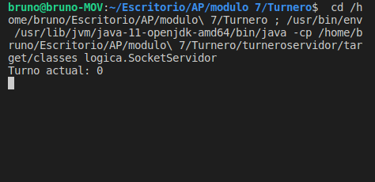
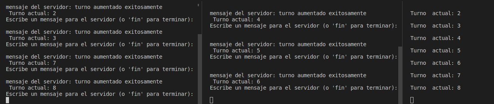
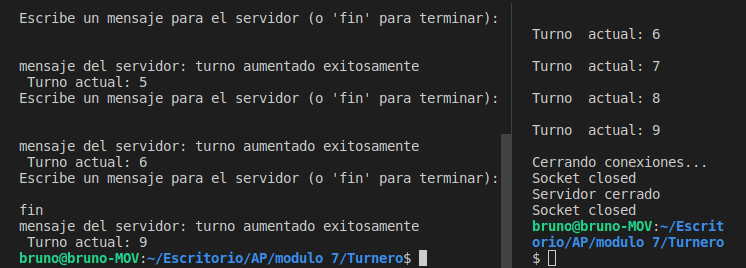

# Proyecto de comunicacion entre sockets 

Este proyecto consiste en un programa que permite a múltiples clientes conectarse a un servidor y comunicarse entre sí. Está desarrollado en Java utilizando sockets para la comunicación en red.

### Problematica a resolver: 
Una casa de electrodomésticos posee 2 cajas en las cuales atiende por turnos a cada uno de sus clientes para el abono de los pagos por las compras realizadas. A cada cliente se le otorga un número con el cual será atendido cuando sea su turno.

Los empleados de cada caja cuentan con una aplicación cliente que, por cada solicitud que envían al servidor, aumentan en 1 el valor de los turnos que se muestran en pantalla a los clientes que aguardan. Por ejemplo: Si el turno se encuentra en el número 15 en la pantalla y un empleado a través de la aplicación cliente envía una solicitud, éste debe aumentar a 16. El encargado de recibir las peticiones y aumentar los turnos es el servidor, el cual se encuentra ejecutándose constantemente a la espera de solicitudes de aumento de turnos.

Se necesita realizar las aplicaciones cliente y servidor necesarias que sea capaces de, a partir de las distintas solicitudes que envían los empleados de la casa de electrodomésticos, aumentar el número de turno que se muestra en la pantalla. Para ello, recordar que el encargado de recibir las solicitudes y mostrar los turnos en pantalla es el servidor, mientras que los encargados de enviar los mensajes son las aplicaciones clientes que se encuentran en la caja de cada empleado. 

El programa servidor permite la conexion de multiples programas clientes.
Para implementar las múltiples conexiones al servidor, se utilizó la clase `Thread`. Cada conexión de cliente se gestiona mediante un hilo individual para permitir que el servidor atienda múltiples solicitudes al mismo tiempo.

Asi se ve el servidor iniciado:

Una vez iniciado el programa servidor los programas cliente podran conectarse a él y enviar mensajes. En este caso opte por que sea posible enviar cualquier mensaje. Una vez recibidos el servidor actualizará el numero de turno y le respondera al cliente que la peticion fue realizada con exito. 

Si un cliente envía el mensaje "fin", se cierra la conexión de todos los sockets cliente y se detiene el servidor. El único problema es que los clientes restantes esperan completar la instrucción `scanner.nextLine()` antes de cerrar el socket.

A través de este proyecto aprendí sobre la comunicacion entre procesos independientes con el uso de sockets para la comunicación en red, el manejo de peticiones de múltiples conexiones y la implementación de un servidor y clientes en Java.

